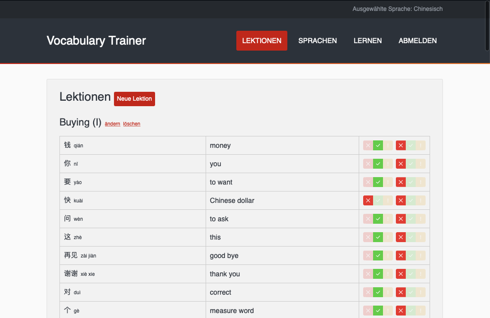
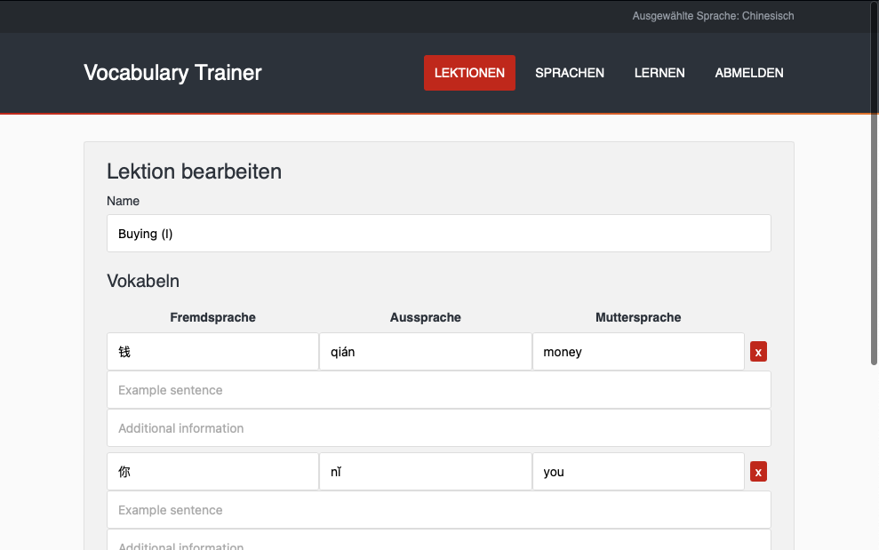
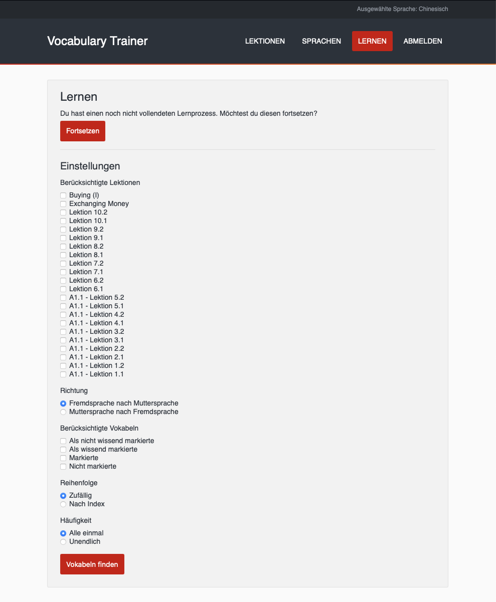
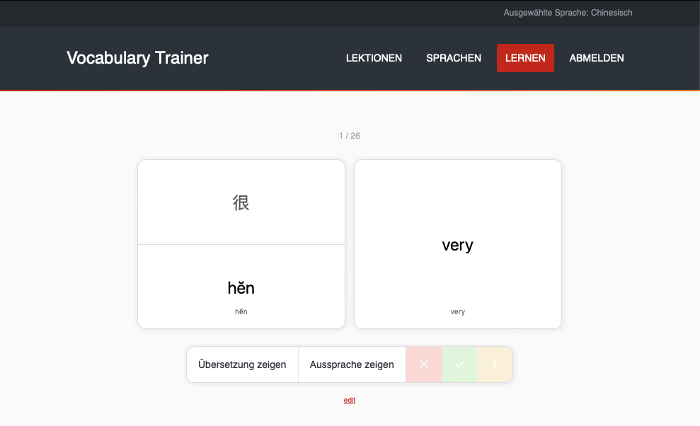

# Simple Vocabulary Trainer

## Functions

- User accounts
- Multiple languages
- Multiple lections
- Add vocabularies in foreign language, foreign pronunciation and mother language to lections
- Each vocabulary can be associated with example sentences and additional information
- Each vocabulary can be marked as ❌ / ✅ / ⚠️ in both language directions
- Learning process: Select lections, language direction, status, and order


## Installation & Running

Use the ``structure.sql`` to set the mysql structure. Use ``vocabulary_trainer`` as table name.
Next, adapt your ``db.js`` to your database credentials.


Run the following commands to install and run the application:
```
npm install
node bin/www
```


## Screenshots




